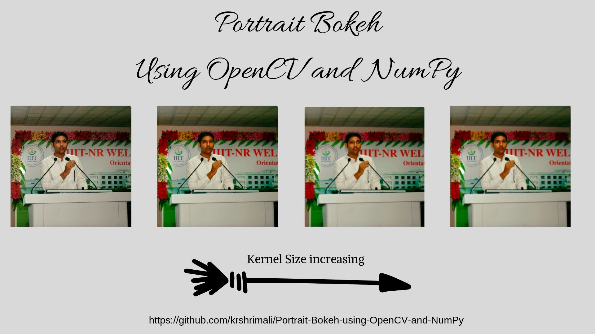

## Portrait-Bokeh-using-OpenCV-and-NumPy

Portrait Bokeh Implementation on Faces using OpenCV and NumPy in Python

## What it does?

1. Blurs everything **except** faces. 
2. Gives you a choice to select which face you want in the foreground.

## Why is it special?

**Note**: Thanks to @vishwesh5 for the hints to proceed with the 1st point below.

1. ROI generally works for only rectangles in OpenCV. This project can do for any shape. 
2. It's cool! 

## Usage

1. Execute the program: `python3 main.py <image_path>`
2. Press Y when asked, if you don't want the face to be blurred. Else press N.
3. Output will be stored as blur.png in the same folder as the python file.

## Example

**Example for single face**:

**Input Image**

**Output Image (kernel size = 5)**

**Output Image (kernel size = 7)**

**Output Image (kernel size = 9)**

